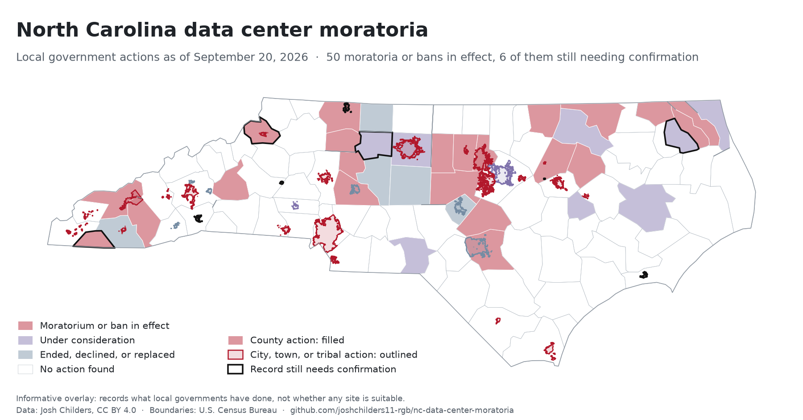

# North Carolina Data Center Moratoria

A map of where North Carolina's counties, cities, towns and tribal governments have
paused or banned new data centers. Every action links to its source, and the records
that are not yet confirmed are marked that way.

**[Open the interactive map](https://joshchilders11-rgb.github.io/nc-data-center-moratoria/)**
and click any shape for its details.

[](https://joshchilders11-rgb.github.io/nc-data-center-moratoria/)

<!-- stats:start -->
| As of 2026-09-24 | |
|---|---:|
| **Moratoria or bans in effect** | **53** |
| &nbsp;&nbsp;of which still need confirmation | 3 |
| &nbsp;&nbsp;county / municipal / tribal | 22 / 30 / 1 |
| Counties containing one | 40 of 100 |
| Adopted in August 2026 alone | 15 |
| Adopted after 2026-08-29 | 6 |
| Under consideration | 10 |
| Ended, declined, or replaced | 11 |
| &nbsp;&nbsp;of which chose permanent regulation instead | 7 |
| Checked, no action found | 65 |
| Records needing confirmation | 4 |
| Expiration dates estimated vs. printed in source | 37 vs. 14 |
| Records changed by research after 2026-08-29 | 24 |
<!-- stats:end -->

## Reading the map

| | Category |
|---|---|
|  | Moratorium or ban in effect |
|  | Under consideration: proposed, scheduled for a vote, or requested by residents |
|  | Ended, declined, or replaced by permanent regulation |
|  | Checked, no action found |

Filled shapes are county actions. Heavy outlines are city, town or tribal actions. A
county with no moratorium can still contain towns that have one: Buncombe County has
none, while Asheville and Woodfin both do.

Black outlines mark records that still need confirmation. Their popups say what is
missing. Records that later research changed carry an "Updated" line in their popup
saying what changed and when.

GitHub's own preview of the GeoJSON file draws every shape in one color and has no
popups. Use the interactive map or the picture above instead.

## Before you quote a number

- **The numbers have a date.** The research table is a snapshot as of August 29, 2026.
  Every county was then re-checked for news through September 24, 2026, and each change
  is recorded with its source in [`data/research_updates.csv`](data/research_updates.csv).
  Moratoria are adopted, extended and allowed to lapse within weeks, so check the source
  before relying on any single record.
- **Three of the 53 still need confirmation.** Each is a recent vote whose minutes are
  not posted yet. Quote 53 with that qualifier, or leave the three outlined records out
  and quote 50.
- **Two records carry a caveat.** Perquimans County held its advertised hearing on
  September 8 and has published nothing since, so it is shown as pending. Charlotte has
  proposed a nine-month extension that has not reached the council's agenda, so its
  pause still ends November 5 unless a later vote moves it.
- **Most expiration dates are estimates.** Where a board said "twelve months", the
  calendar date is arithmetic, and the map labels those dates *(estimated)*. Even a
  printed date can move: some moratoria end as soon as the new rules are finished, and
  boards can vote to extend them.
- **40 counties counts land covered.** The Qualla Boundary spans five counties. Counting
  it as one jurisdiction gives 39.
- **The map shows decisions, not data centers.** A red county has paused or banned new
  ones. It says nothing about whether any data center exists or is planned there.

## What's here

| File | |
|---|---|
| [`data/nc_data_center_moratoriums.csv`](data/nc_data_center_moratoriums.csv) | The research table: one row per jurisdiction, with dates, terms, rationale, confidence, and a source for each action, as of August 29, 2026. **The source of truth.** |
| [`data/research_updates.csv`](data/research_updates.csv) | Later research. Each row is a complete record that replaces the table's row for that jurisdiction, or adds one, and says what changed and when. |
| [`data/research_log_2026-09.md`](data/research_log_2026-09.md) | What the September re-check found, record by record, with sources. |
| [`data/nc_datacenter_moratoria.geojson`](data/nc_datacenter_moratoria.geojson) | The map layer, built from the two tables (WGS 84). |
| [`data/summary.json`](data/summary.json) | The counts above, recomputed on every build. |
| [`data/map.png`](data/map.png) | The picture above, redrawn on every build. |
| [`index.html`](index.html) | The interactive map, served by GitHub Pages. |
| [`build/build_layer.py`](build/build_layer.py) | Joins the tables to Census boundaries and writes the layer. |
| [`build/render_map.py`](build/render_map.py) | Draws the picture from the layer. |

## Rebuilding

```bash
pip install -r build/requirements.txt
python build/build_layer.py
python build/render_map.py
```

Boundaries download from the U.S. Census Bureau on first run. Pushing a change to
either CSV rebuilds the layer, the summary, the picture and the table at the top of
this README automatically.

Status is judged as of `STATUS_AS_OF` in `build/build_layer.py`, not the day the build
runs, and the build refuses to run if any row in `research_updates.csv` was researched
after that date. When you add newer research, move the date forward in the same change.
The notes under *Before you quote a number* are written by hand and need updating too.

## How the records were built

Records were checked against agenda portals, adopted ordinances and local news,
preferring government records where they could be retrieved. The work corrected the
list it started from, which had attributed actions by identically named counties in
Georgia, Florida, Texas and Arkansas to North Carolina, and had labeled several city
actions as county actions.

Every row carries a `confidence` rating for how well its dates are sourced, and a
`status` for whether the action happened at all. They measure different things: a
well-dated record can still be unconfirmed.

The September 2026 update re-checked every county for news published through
September 24, along with every jurisdiction that had a vote, hearing or expiration
pending. It found eleven more moratoria in effect, five jurisdictions newly weighing
one, and two extensions that kept moratoria from lapsing, including Mount Airy's,
which the arithmetic would otherwise have shown as expired. A second pass went after
government records for every uncertain entry and confirmed most of them. Where the
evidence is still a single newsletter or a passing mention in a news story, the record
says so and is outlined in black.

## Sources

- Jurisdiction records: the `source_url` column of each CSV row.
- Boundaries: U.S. Census Bureau, 2021 cartographic boundary files (counties, places
  and American Indian areas).

## License

Data in [`data/`](data/) is licensed under [CC BY 4.0](data/LICENSE.md): reuse it
freely, with credit. Code in [`build/`](build/) and [`index.html`](index.html) is
licensed under [MIT](LICENSE). Census boundary files are U.S. government works in the
public domain.

**Suggested citation:** Childers, J. (2026). *North Carolina Data Center Moratoria*
[Data set]. https://github.com/joshchilders11-rgb/nc-data-center-moratoria

## Author

Josh Childers
